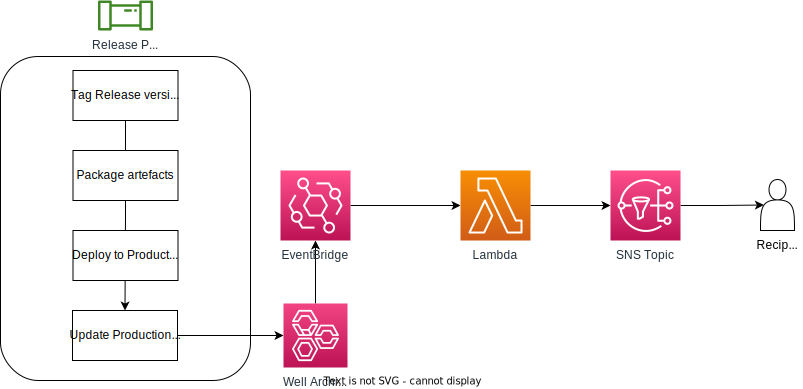

# AWS Well-Architected Tool Automation
This is a playground repo for automating the creation of AWS Well-Architected Framework resources. NOTE: Creating and managing resources in the AWS Well-Architected Tool is not currently supported in Terraform. There is a feature request open for this, which can be tracked [here](https://github.com/hashicorp/terraform-provider-aws/issues/29755).



## Requirements
* Shellcheck (for linting bash functions)
* awscli version `2.10.1`
* terraform version `~v1.2.7`

## Setup
### Well Architected Tool Resources
To create resources in the Well Architected Tool, create a config file in the `config/` directory. Update both scripts to point to your chosen config file. Run `create_workload.sh` to create a workload, and `create_milestone.sh` to create a milestone for the same workload.

### Notifications
The supplied terraform in the `wellarch-notify/` directory creates the following resources:
  * Lambda function
  * SNS topic
  * IAM policies for Lambda function
  * EventBridge rule
  * CloudWatch Log Group for EventBridge

To enable this functionality, either clone this repository locally or reference it in your IaC codebase:
```hcl
module "wellarch-notify" {
  source       = "rudolphjacksonm/aws-wafr-playground//wellarch-notify"
  sns_endpoint = var.sns_endpoint
  tags         = var.tags
}
```
